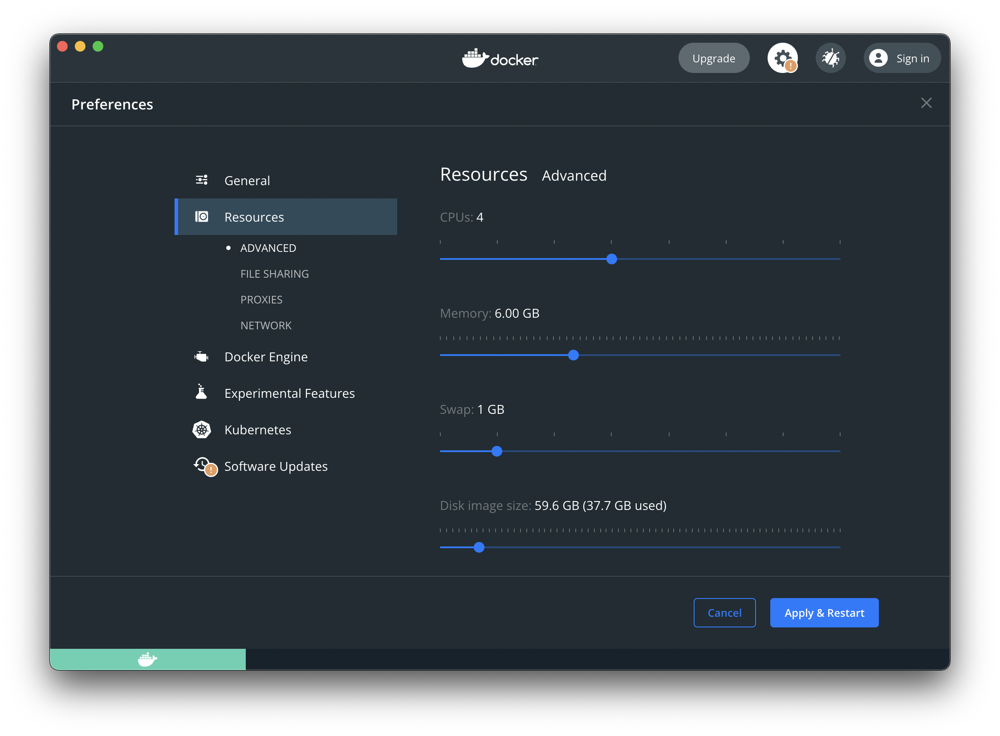

# Prerequisites to install OpenServerless with Docker

You can install OpenServerless on your local machine using Docker. This
page lists the prerequisits.

First and before all you need a computer with at least 16 GB of memory
and 30GB of available space.

8GB are definitely **not enough** to run OpenServerless on your local
machine.

Furthermore, you need to install Docker. Let’s see the which one to
install and configure if you ave:

- [Windows](#windows)

- [MacOS](#macos)

- [Linux](#linux)

You require the 64 bit edition in Intel Architecture of a recent version
of Windows (at least version 10). The installer `nuv` does not run on 32
bit versions nor in the ARM architecture.

Download and install [Docker
Desktop](https://www.docker.com/products/docker-desktop/) for Windows.

Once installed, you can proceed [configuring
OpenServerless](#../../configure/index.adoc) for the installation.

You require a recent version of MacOS (at least version 11.xb BigSur).
The installer `nuv` is available both for Intel and ARM.

Download and install [Docker
Desktop](https://www.docker.com/products/docker-desktop/) for MacOS.

Since MacOS uses a virtual machine for Docker with a constrained memory.
you also need also to reserve at least 8GB.

On MacOS, the default 2GB and they are definitely **not enough** to run
OpenServerless on your local machine.

<figure>

</figure>

Instructions to increase the memory reserved to Docker Desktopo on
MacOS:

- click on the Docker Desktop icon in the menu

- select Preferences

- click on Resources

- *increase the reserved memory up to (at least) 8GB*

- click on `Apply & Restart`

Once installed, you can proceed [configuring
OpenServerless](#../../configure/index.adoc) for the installation.

Docker Desktop is available also on Linux, however we advice to install
instead the [Server Docker
Engine](https://docs.docker.com/engine/install/#server)

On Linux, the Docker Engine for the server does not run in a virtual
machine, so it is faster and uses less memory.

Once installed, you can proceed [configuring
OpenServerless](#../../configure/index.adoc) for the installation.
